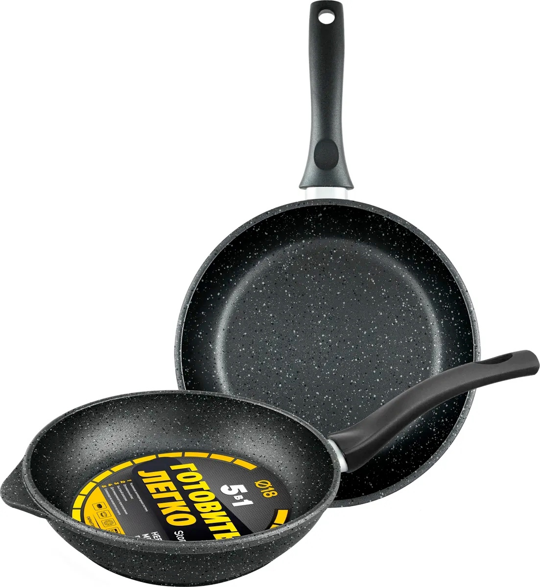
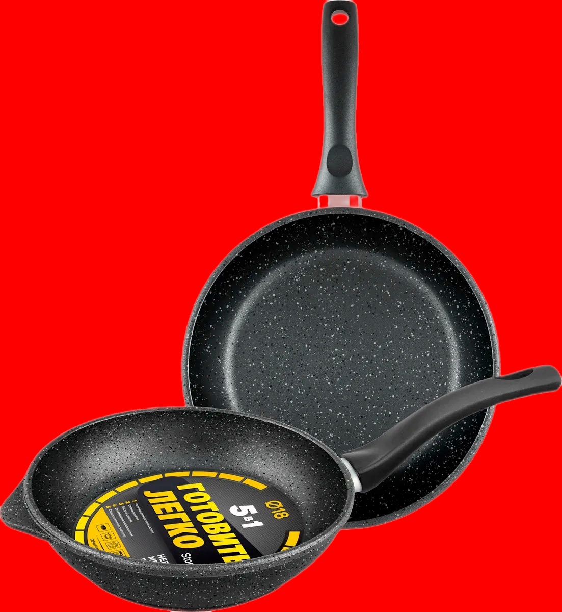
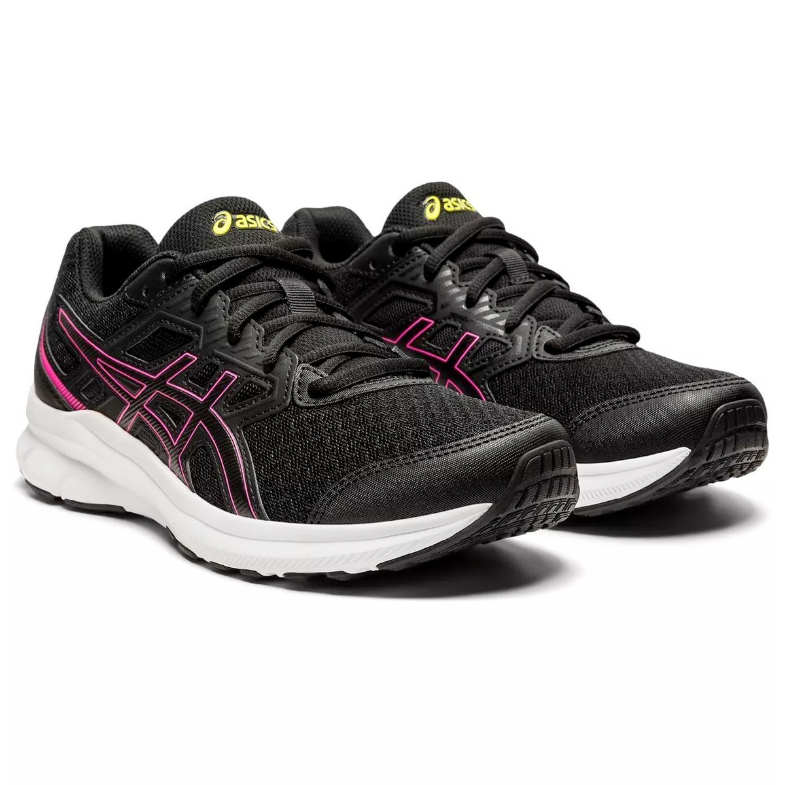
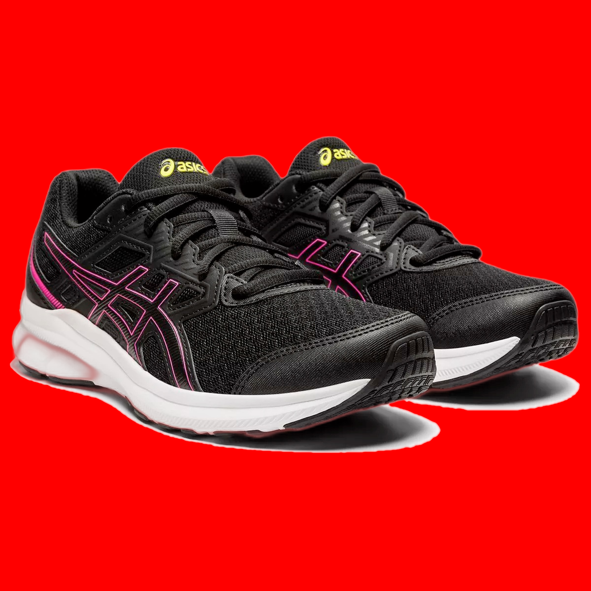
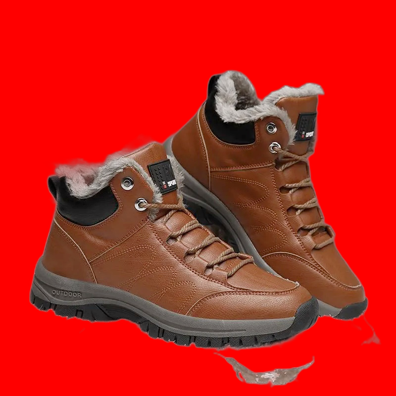
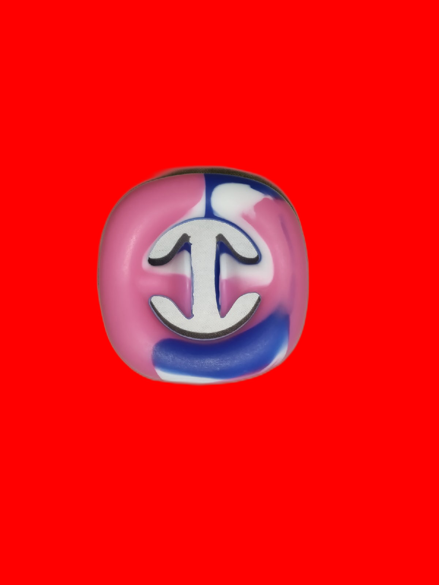
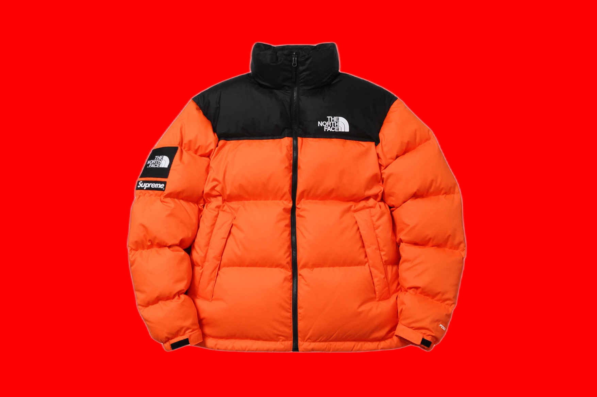

# python-inference-api

Это слегка устаревшая, но рабочая версия веб-сервера на Python, в который можно заворачивать модели и обращаться к ним по  АПИ.

- `Dockerfile` - конфигурация контейнера (вашей виртуальной машины)
- `server.py` - точка входа (aka main) + rest controller, которая запускает веб-сервер, слушает порт и делегирует запросы модели. основан на `cherrypy`
- requirements.txt - ваши зависимости. 
- config.yml - параметра (хост, порт, размер пула, любые другие).

## Основные варианты обращения к сервису по вырезанию фона

- `/cutout` - принимает один параметр (`img`) закодированное битовое представление картинки, у которой требуется вырезать фон. 
В ответ приходит обработанное закодированное изображение в поле `result`. 
- `/cutouts` - принимает массив закодированных изображений в параметре (`imgs`). 
В ответ отдает массив обработанных закодированных изображений в поле `result`. 

Везде используется кодировка `ISO-8859-1`. 
[Примеры создания запросов](tests/requests_test.py)

## Результаты работы

Исходное изображение | Результат | 	Время работы, с.
--- | --- | ---
 |  | 7.091
 |  | 7.297
 |  | 6.594
 |  | 6.594
 |  | 5.844
 |  | 5.844
 |  | 7.64
 |  | 7.125
 |  | 7.656
 |  | 7.594
 |  | 7.281
 |  | 7.281
