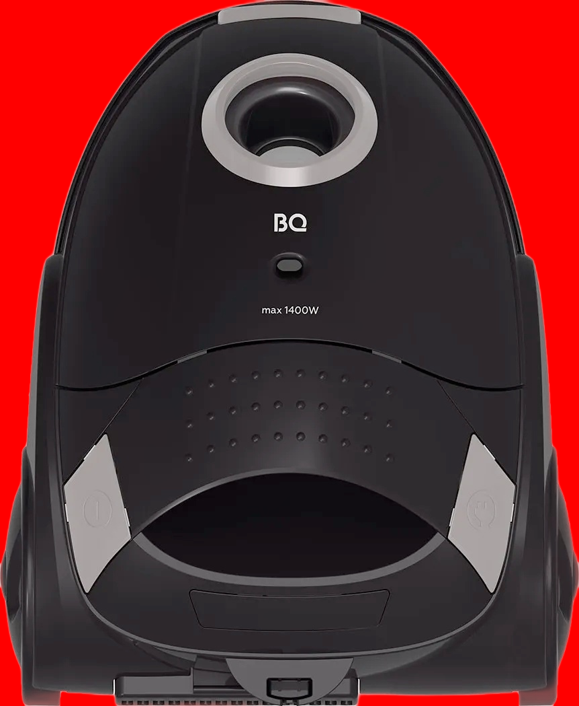
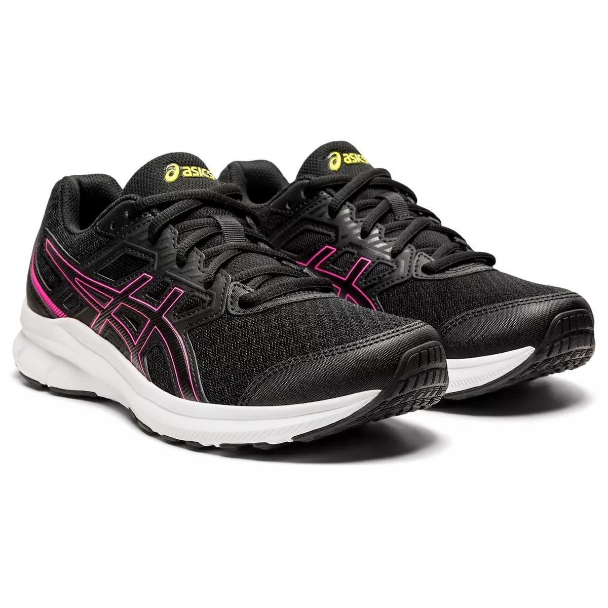

## Результаты работы

Исходное изображение | Результат | Среднее время работы алгоритма на основании 20 запусков, с.
--- | --- | ---
 |  | 2.503195
 |  | 2.94518695
 |  | 2.9668558
 |  | 2.82756589
 |  | 2.17902585
