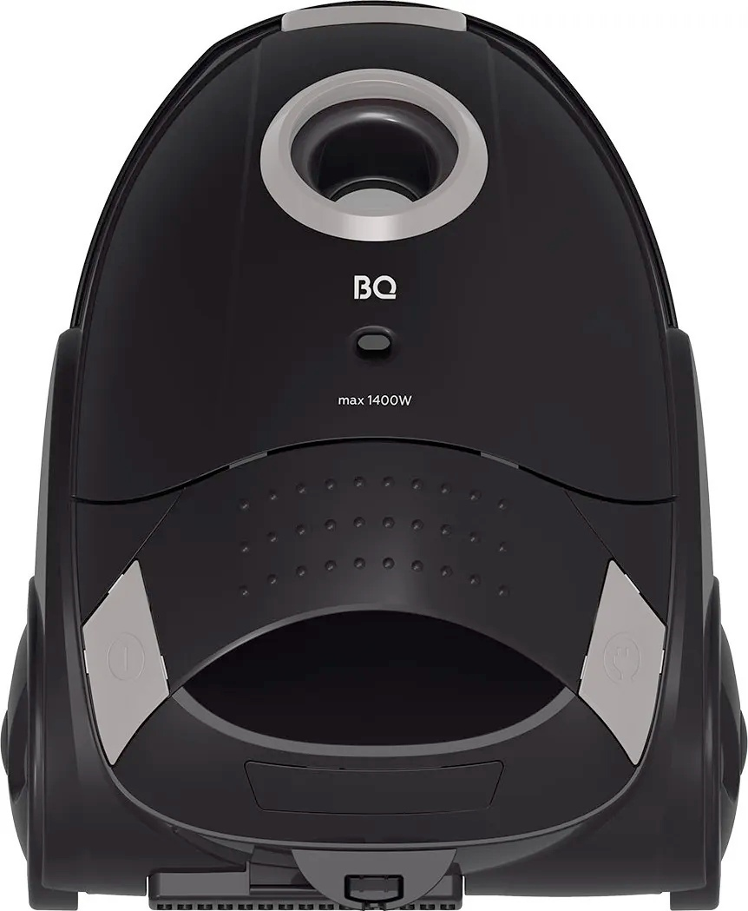
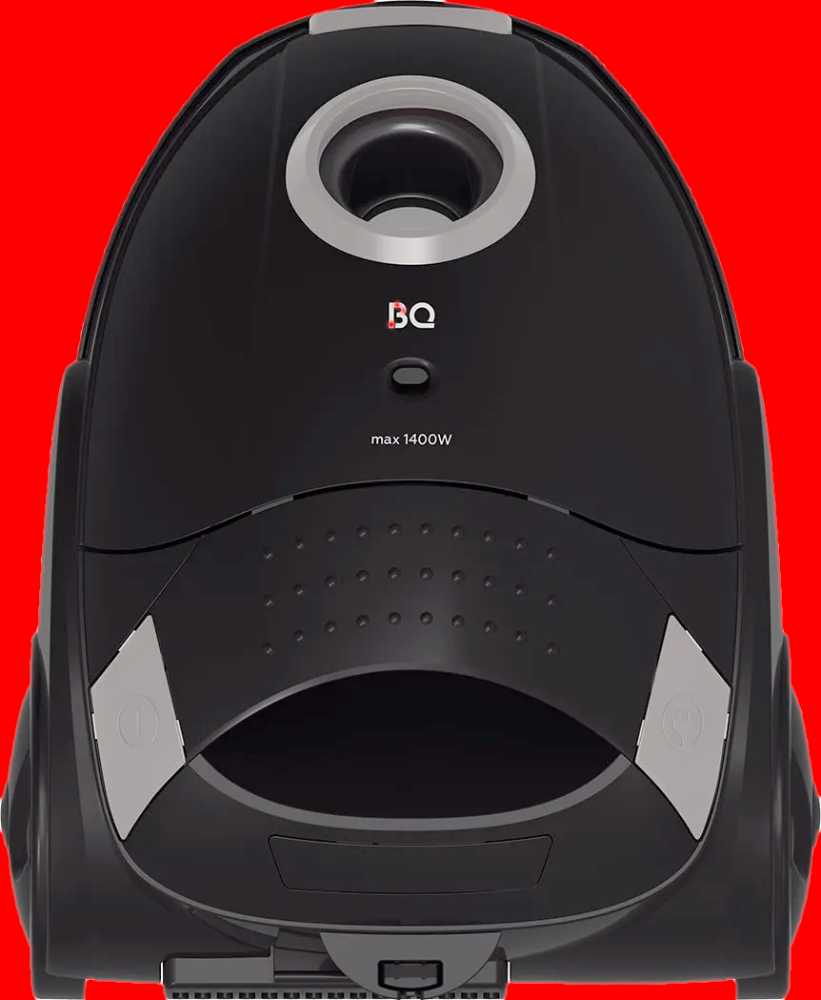
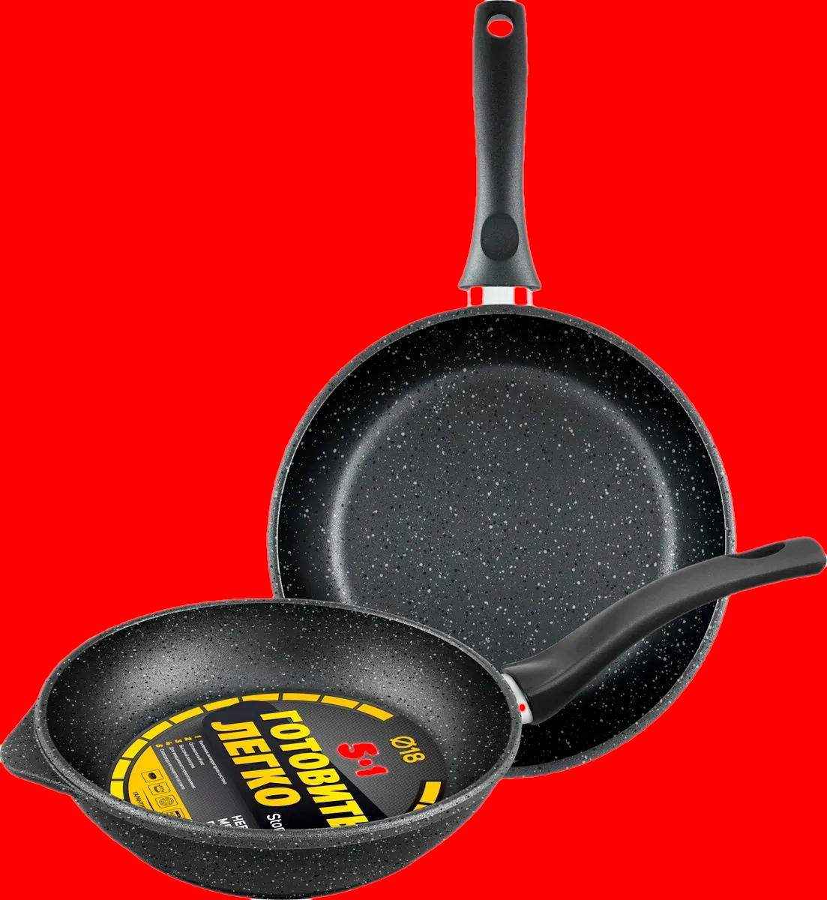
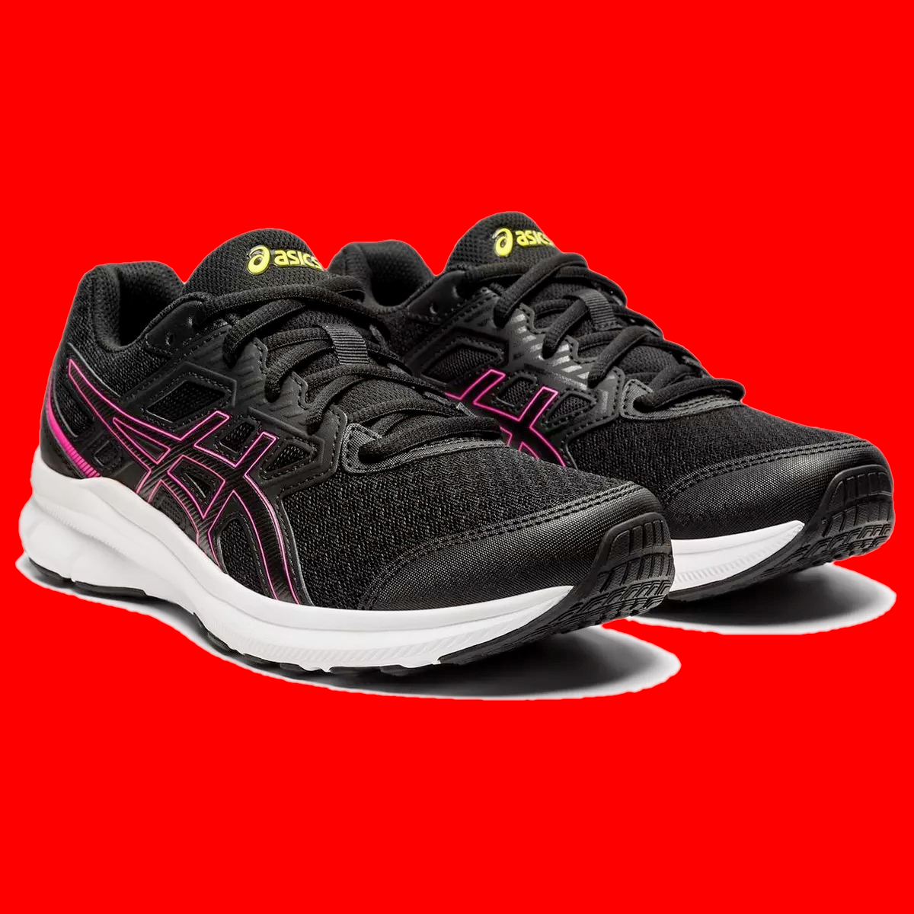
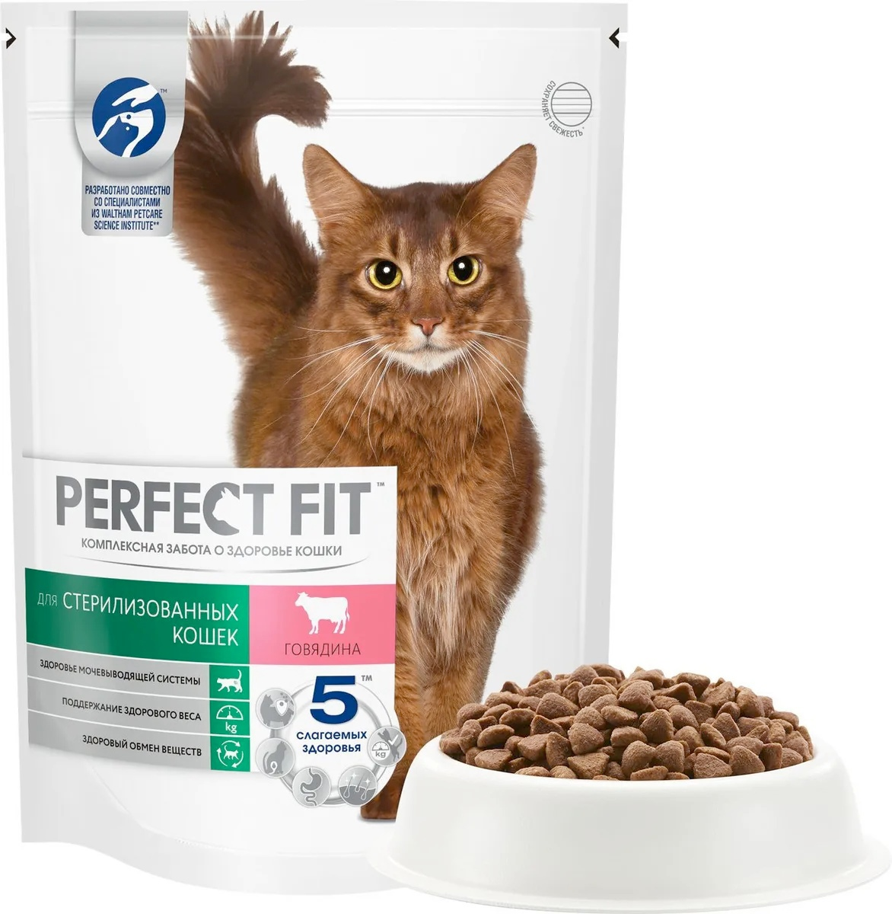
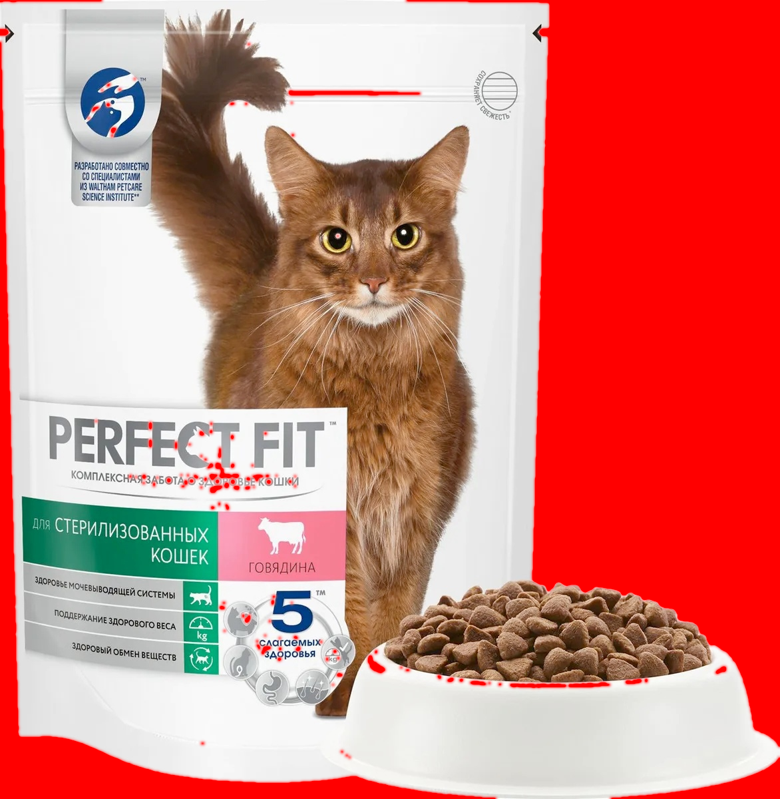
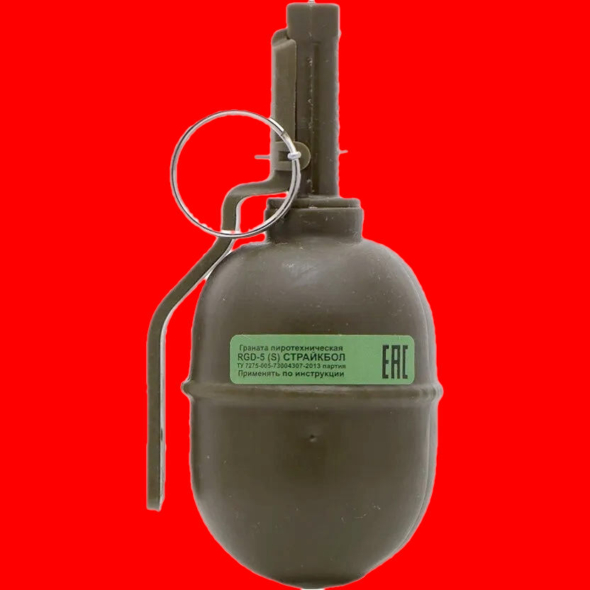
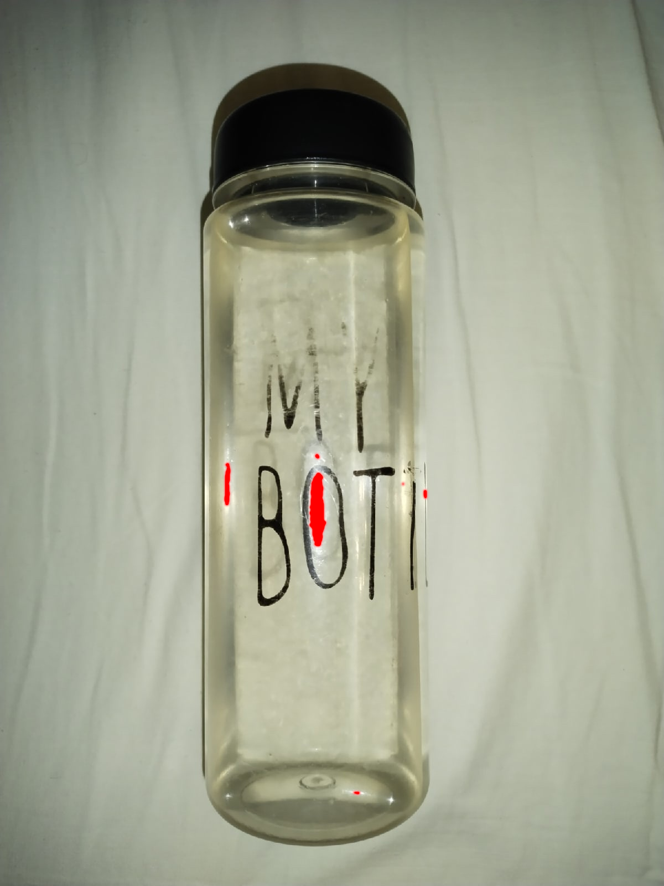
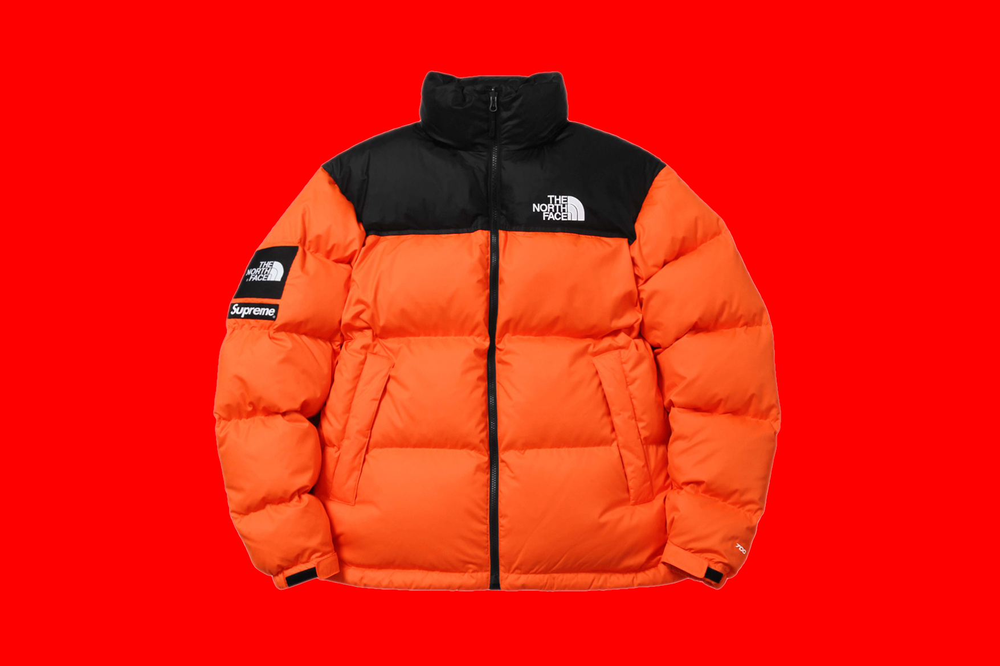
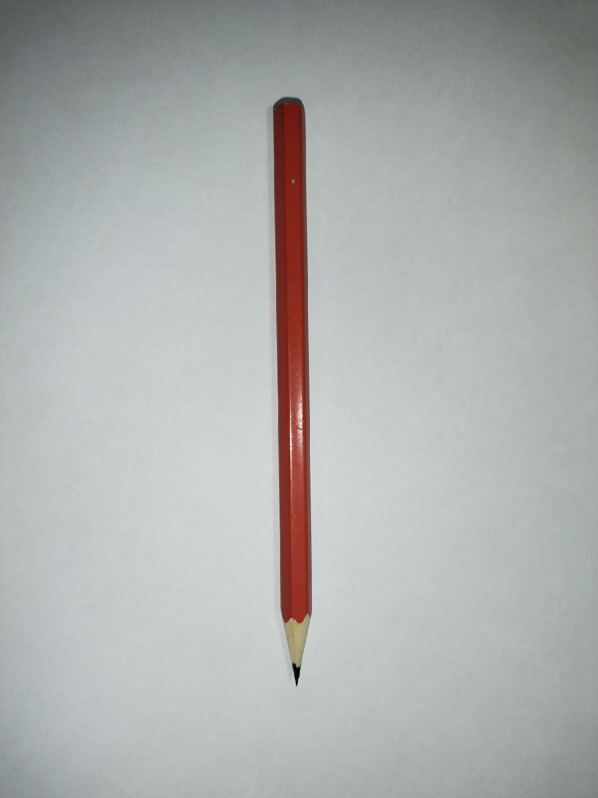

## Результаты работы

Исходное изображение | Результат | Среднее время работы алгоритма на основании 100 запусков, с.
--- | --- | ---
 |  | 0.153642039
 |  | 0.2341197
 |  | 0.25479117
 |  | 0.234942319
 |  | 0.13742169
 |  | 0.07705726
 |  | 0.17675038
 |  | 0.16684078
 |  | 0.18365343
 |  | 0.18919819
 |  | 0.16941387
