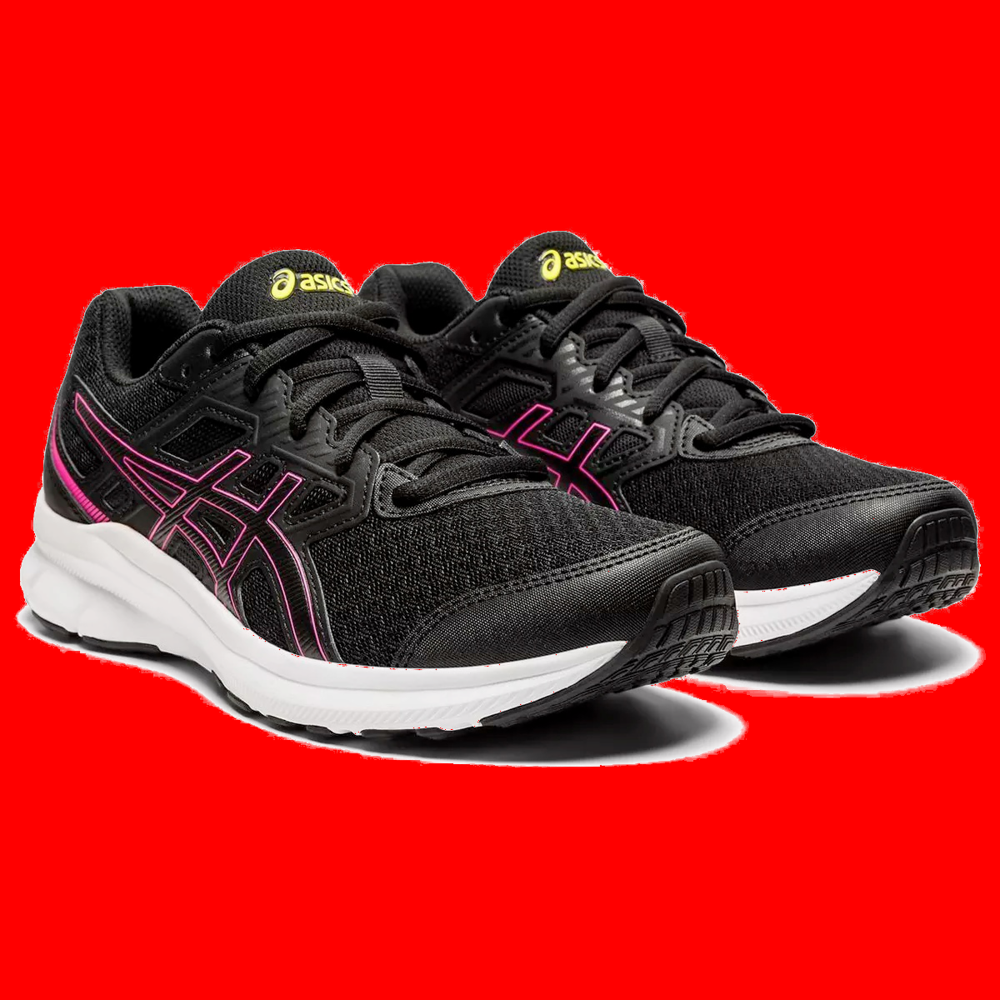
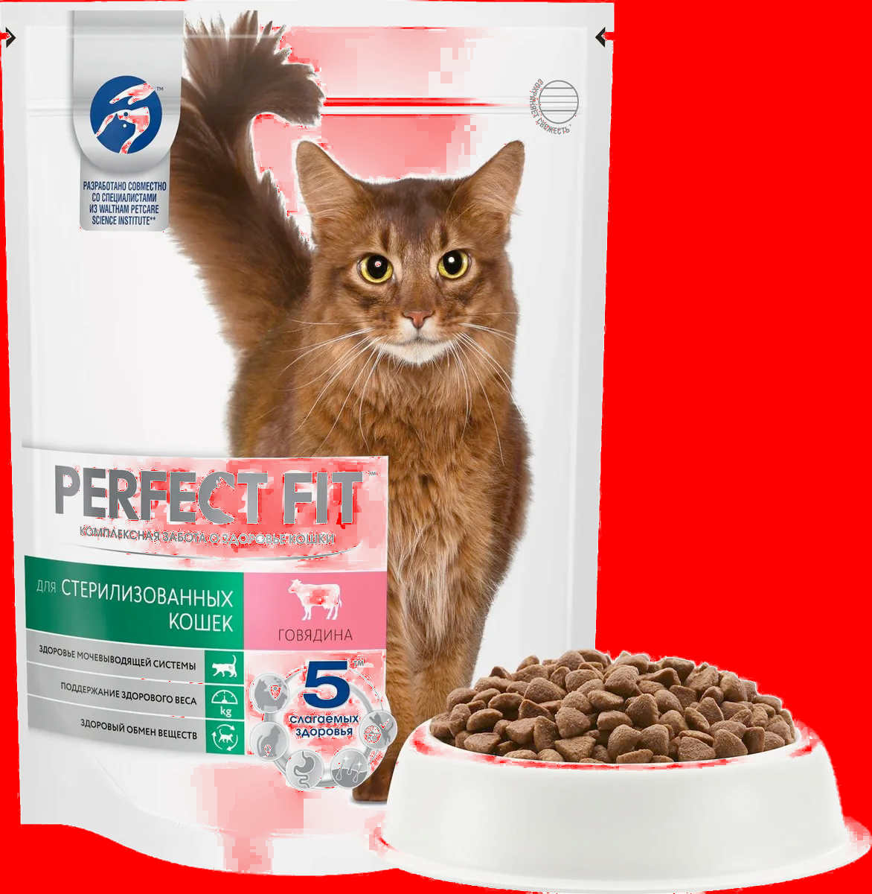
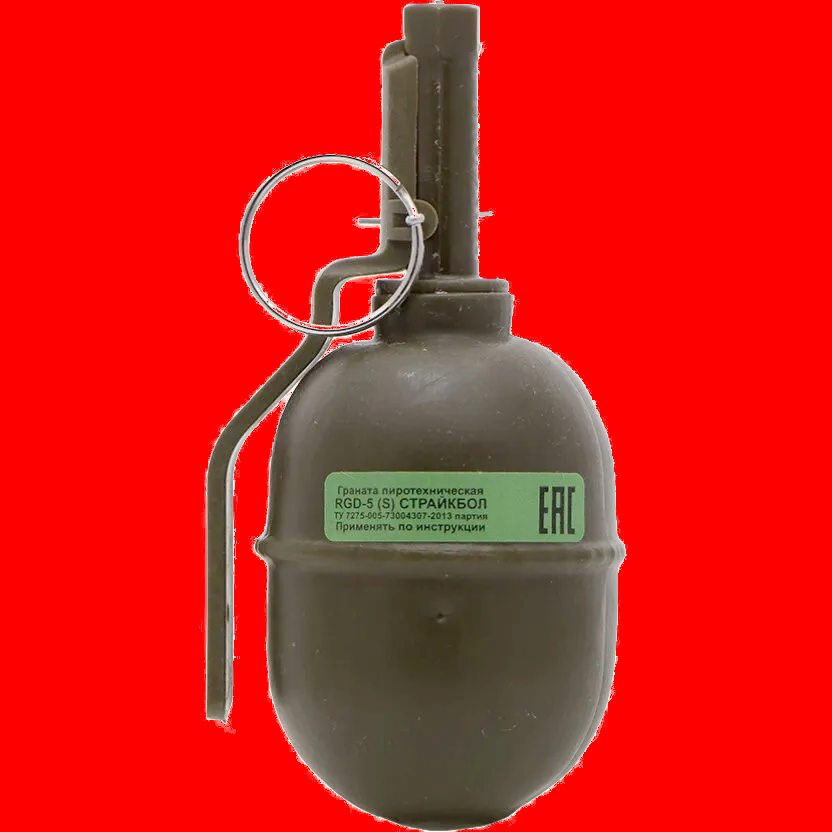

## Результаты работы

Исходное изображение | Trimap | Результат | Среднее время работы алгоритма на основании 100 запусков без учета построение Trimap, с.
--- | --- | --- | ---
 |  |  | 0.97802903
 |  |  | 1.435614089 
 |  |  | 1.596586519
 |  |  | 2.006413689
 |  |  | 0.80470169
