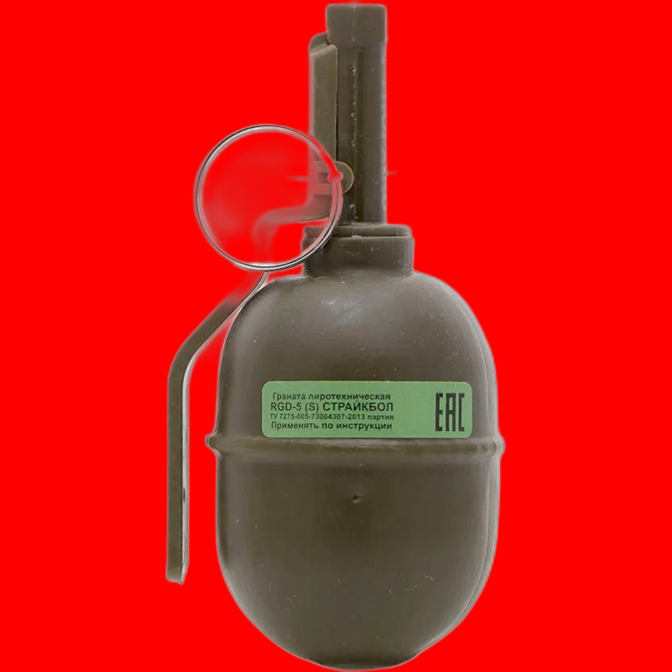

## Результаты работы

Исходное изображение | Результат | 	Среднее время работы алгоритма на основании 20 запусков без учета построение Trimap, с.
--- | --- | ---
 |  | 2.148230549
 |  | 2.377928449
 |  | 2.38044509
 |  | 2.2304448
 |  | 1.93884069
